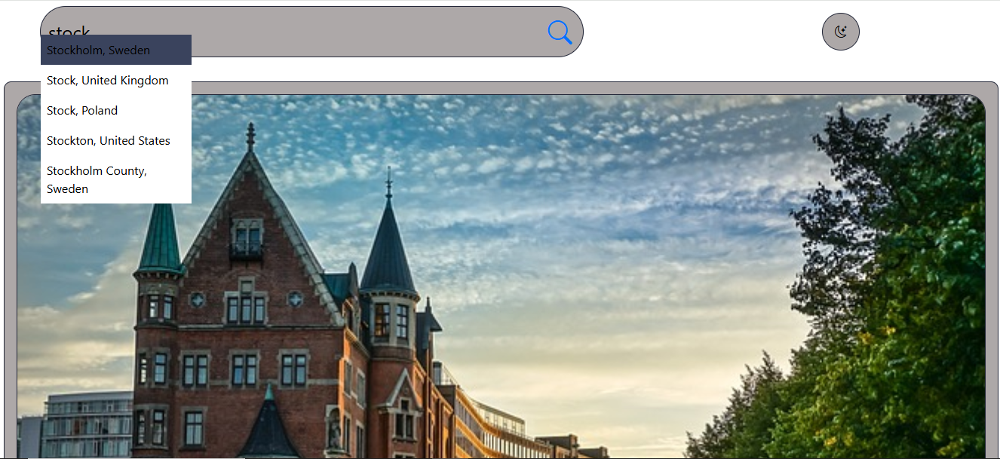
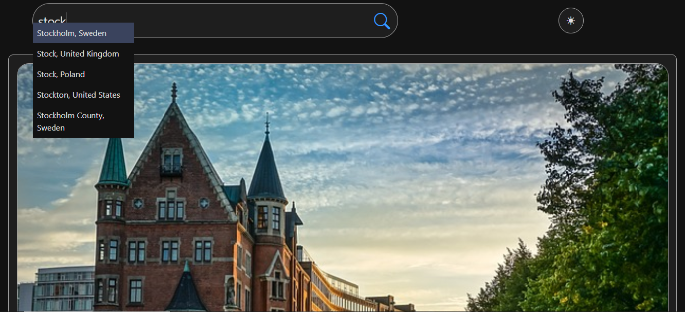
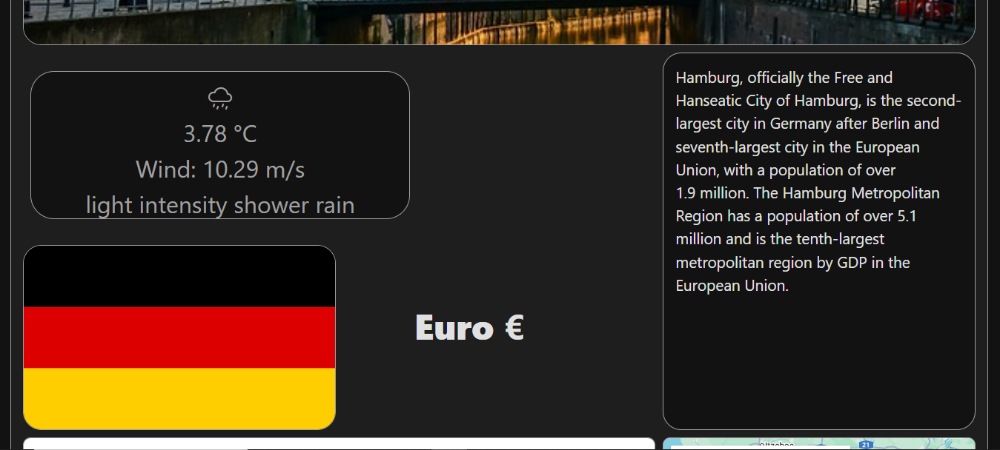
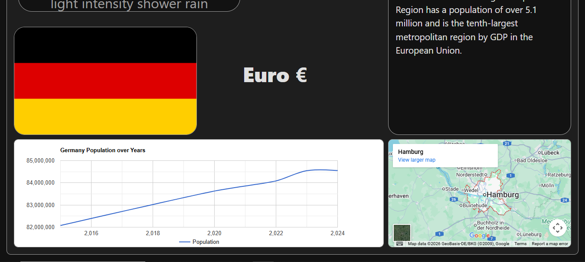
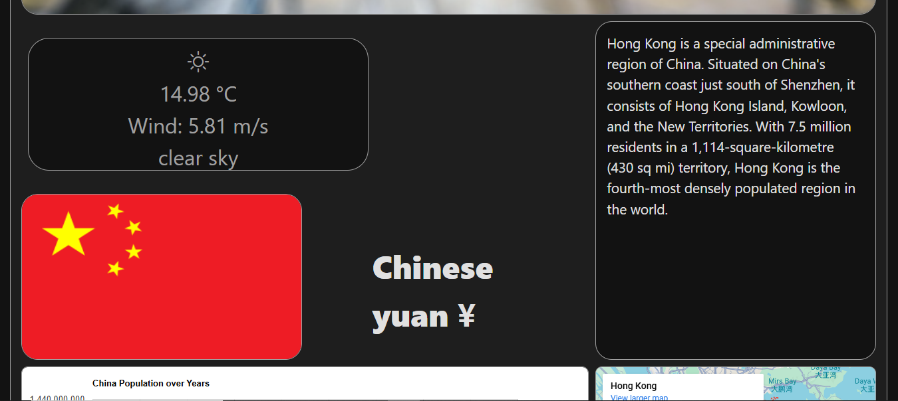
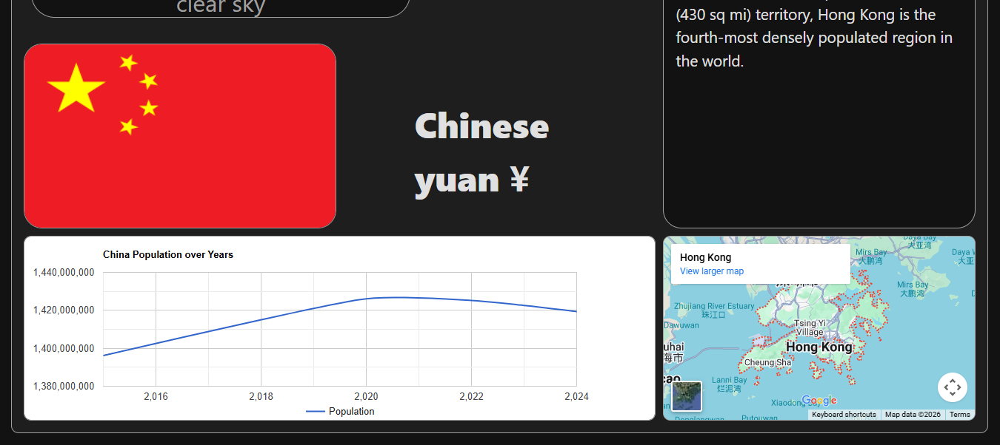

# CityExplorer App

CityExplorer is a web application that displays detailed and dynamic information based on a selected city.

The application provides a modern user interface with support for **light and dark mode**.

## 🌞 Light Mode

## 🌙 Dark Mode

The application features a **search-as-you-type functionality**, offering real-time city suggestions while typing.  
Users can also switch seamlessly between light and dark mode.

In addition, the app displays important city and country information such as:
- National flag
- Currency
- General city details

It also shows the **current weather conditions**, including temperature and wind speed.

Finally, the application visualizes the **population development** of the selected city using a chart and displays an **interactive map**, allowing users to zoom in and explore the location.

---

## 🔌 APIs Used

The following public APIs are integrated into the project:

- **[OpenWeatherMap API](https://openweathermap.org/api)**  
  Used to fetch real-time weather data.

- **[Pixabay API](https://pixabay.com/api)**  
  Used to retrieve city-related images.

- **[API Ninjas – Population API](https://api.api-ninjas.com/v1/population)**  
  Used to fetch population data.

- **[Photon (Komoot) API](https://photon.komoot.io/api)**  
  Used for geocoding and city search suggestions.

- **[REST Countries API](https://restcountries.com/v3.1/name/)**  
  Used to retrieve country-related information such as currency, language, and flag.

---

## 📸 More Screenshots

### 🌇 Hong Kong, China

---

## ⚠️ Important

Since this application uses multiple REST APIs, **some of them require an API key** in order to function correctly.  
Please ensure that valid API keys are provided before running the application.
